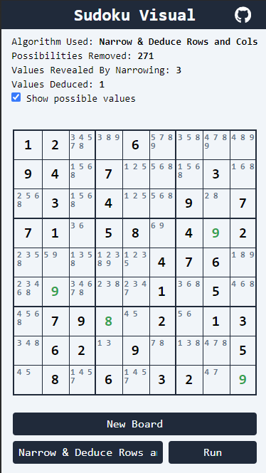

    

<h3 align="center">Sudoku-Visual</h3>

  

  A visualizer for sudoku solving methods that are similar to how a human would solve a sudoku
  

     
    <a href="https://sudoku-visual.vercel.app/"><b>Live Site</b></a>
     
    <a href="https://github.com/daviszung/sudoku-visual/issues">Report Bugs or Request Features</a>
  

<!-- TABLE OF CONTENTS -->

  
Table of Contents

  <ol>
    <li>
      <a href="#about-the-project">About The Project</a>
      <ul>
        <li><a href="#built-with">Built With</a></li>
        <li><a href="#dependencies">Dependencies</a></li>
        <li><a href="#motivation">Motivation</a></li>
        <li><a href="#algorithms">Algorithms</a></li>
      </ul>
    </li>
    <li><a href="#usage">Usage</a></li>
    <li><a href="#contributing">Contributing</a></li>
    <li><a href="#license">License</a></li>
  </ol>

## About The Project

### Built With

* 
* 
* 
* 

### Dependencies
This project uses <a href="https://sudoku-api.vercel.app/">Dosuku</a>, a graphQL based API for generating valid sudoku puzzles.

Site Link: https://sudoku-api.vercel.app/

### Motivation
I have seen other sudoku solving visualizations, but have only seen people use the backtracking algorithm as a solution. I thought it would be interesting to create a visualization/simulation of how other algorithms can make progress or even fully solve a sudoku puzzle. 

Additionally, the backtracking solution to solving a sudoku is far from how a human solves a sudoku puzzle. The algorithms spotlighted with this visualizer are closer to how a human would solve a sudoku, which seemed like an interesting thing to visualize. 

(<a href="#readme-top">back to top</a>)

### Algorithms

#### Narrow By Region

Narrow by Region looks at each square on the board, and for every square it looks at all of the square's possible values. Let's say a square has two possible values, 5 and 7. The algorithm checks if 5 or 7 are anywhere else in that 3x3 region of the board. If it doesn't find 5 or 7 anywhere else, it moves to the next square. But if it does find one of those values (let's say it finds 7), it will remove 7 from the possible values of that square, and then count how many possible values the square has left. Since 5 is the only remaining possible value, we are able to determine that the value of the square is 5!

#### Deduce By Region

Deduce by Region looks at each square on the board, and for every square it looks at the possible values of the square.
For each of the possible values of that square, it looks at each of the possible values for the other squares in the same region, and tries to match the values. 
If the possible value that is being examined is not a possible value for any other square in the region, we can deduce that the square must be that value, since no other squares in the region could be!

#### Narrow And Deduce By Rows And Columns
This algorithm applies the same narrowing process and deduction process that we applied to the regions, but to the rows and columns instead. 

Through the use of these three algorithms, we are able to gain a lot of information about what a possible solution may look like, and through repeated use of these algorithms, we can even solve some of the easier puzzles.

#### Backtracking
Check out this wikipedia article, it explains the backtracking strategy better than I ever could.
https://en.wikipedia.org/wiki/Sudoku_solving_algorithms#Backtracking

#### Backtracking (Slow Mode)
Slow mode puts a bit of delay between each time a value is assumed in the backtracking algorithm, as well as updating the UI for the individual cell update. This makes it a bit easier to see what is going on in the backtracking algorithm.

## Usage

Before using any visualizations, you must first have a board. Click on the "new board" button to generate a new board. You can then select between the various algorithms and click the "Run" button to run the algorithm and see the result.

1. Narow By Region
2. Narrow and Deduce by Rows and Columns
3. Deduce By Region
4. Backtracking
5. Backtracking (Slow Mode)

Additionally, you can toggle whether or not you want to see the possible values that the app has detected for each empty cell. By running narrowing algorithms, you can eliminate possibilities and get closer to a valid value for the cell

(<a href="#readme-top">back to top</a>)

## Contributing

If you have a suggestion that would make the project better, please fork the repo and create a pull request. You can also simply open an issue with the tag "enhancement".

Don't forget to give the project a star! Thanks again!

1. Fork the Project
2. Create your Feature Branch (`git checkout -b feature/AmazingFeature`)
3. Commit your Changes (`git commit -m 'Add some AmazingFeature'`)
4. Push to the Branch (`git push origin feature/AmazingFeature`)
5. Open a Pull Request

(<a href="#readme-top">back to top</a>)

## License

Distributed under the MIT License. See `LICENSE.txt` for more information.
