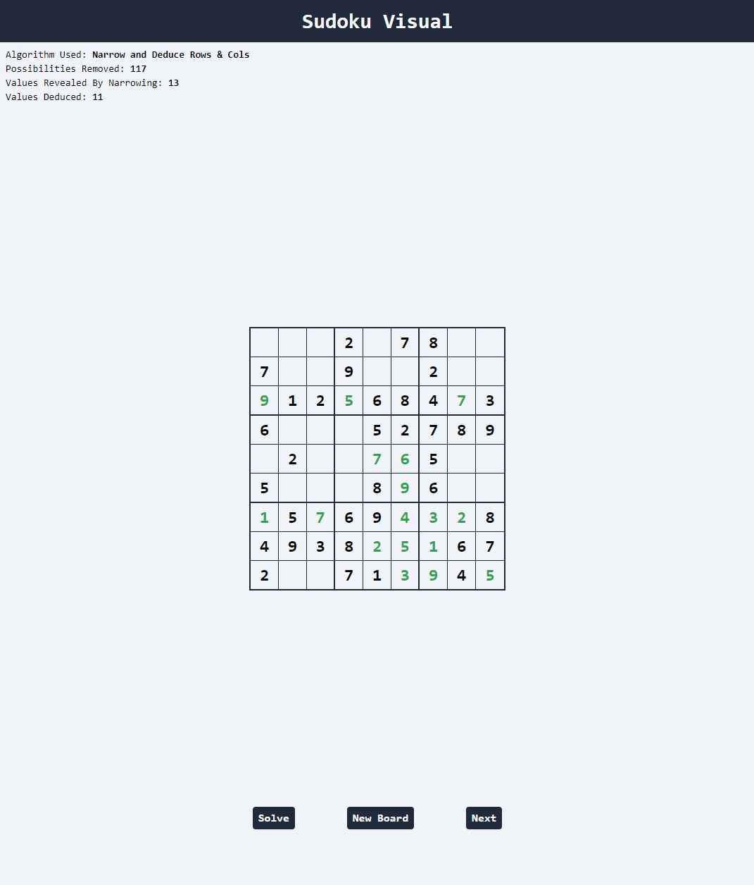

    

<h3 align="center">Sudoku-Visual</h3>

  

  A visualizer for sudoku solving methods that are similar to how a human would solve a sudoku
  

     
    <a href="https://sudoku-visual.vercel.app/"><b>Live Site</b></a>
     
    <a href="https://github.com/daviszung/sudoku-visual/issues">Report Bugs or Request Features</a>
  

<!-- TABLE OF CONTENTS -->

  
Table of Contents

  <ol>
    <li>
      <a href="#about-the-project">About The Project</a>
      <ul>
        <li><a href="#built-with">Built With</a></li>
        <li><a href="#dependencies">Dependencies</a></li>
        <li><a href="#motivation">Motivation</a></li>
        <li><a href="#algorithms">Algorithms</a></li>
      </ul>
    </li>
    <li><a href="#usage">Usage</a></li>
    <li><a href="#contributing">Contributing</a></li>
    <li><a href="#license">License</a></li>
  </ol>

## About The Project

### Built With

* 
* 
* 
* 

### Dependencies
This project uses <a href="https://sudoku-api.vercel.app/">Dosuku</a>, a graphQL based API for generating unsolved sudoku boards.

Site Link: https://sudoku-api.vercel.app/

### Motivation

### Algorithms

#### Narrow By Region

Narrow by Region looks at each square on the board and for every square it looks at all of the square's possible values. Let's say a square has two possible values, 5 and 7. The algorithm checks if 5 or 7 are anywhere else in that 3x3 region of the board. If it doesn't find 5 or 7 anywhere else, it moves to the next square. But if it does find one of those values (let's say it finds 7), it will remove 7 from the possible values of that square, and then count how many possible values the square has left. Since 5 is the only remaining possible value, we are able to determine that the value of the square is 5!

## Usage

Use this space to show useful examples of how a project can be used. Additional screenshots, code examples and demos work well in this space. You may also link to more resources.

_For more examples, please refer to the [Documentation](https://example.com)_

(<a href="#readme-top">back to top</a>)

## Contributing

If you have a suggestion that would make the project better, please fork the repo and create a pull request. You can also simply open an issue with the tag "enhancement".

Don't forget to give the project a star! Thanks again!

1. Fork the Project
2. Create your Feature Branch (`git checkout -b feature/AmazingFeature`)
3. Commit your Changes (`git commit -m 'Add some AmazingFeature'`)
4. Push to the Branch (`git push origin feature/AmazingFeature`)
5. Open a Pull Request

(<a href="#readme-top">back to top</a>)

## License

Distributed under the MIT License. See `LICENSE.txt` for more information.
